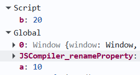

# Hoisting, `window` Object, `this` Keyword, undefined and not defined

Hoisting is a behavior in JavaScript where the engine allocates memory for variable and function declarations during the compile (memory creation) phase, before the code is executed.

---

## 🚀 Hoisting in Action

Here is a basic example of how JavaScript behaves during execution:

```javascript
// Example Code
getName(); // Output: "JS in Depth"
console.log(x); // Output: undefined
console.log(getName); // Output: [Function: getName]

var x = 7;
function getName() {
  console.log("JS in Depth");
}
```

### How JavaScript Interprets It (Hoisted Version):

```javascript
var x = undefined; // Hoisted and initialized
function getName() {
  // Fully hoisted
  console.log("JS in Depth");
}

getName();
console.log(x);
console.log(getName);

x = 7; // Assignment stays in place
```

---

## 📦 Variable Hoisting

### `var`

- The declaration is **hoisted** and initialized with `undefined`.
- It can be accessed before its declaration, but its value will be `undefined` until the assignment line is reached.

### `let` & `const`

- The declaration is **hoisted**, but it is **not initialized**.
- It remains in the **Temporal Dead Zone (TDZ)** until the line of declaration is executed.
- Accessing it before declaration results in a `ReferenceError` (`"Cannot access 'x' before initialization"`).

---

## ⚙️ Function Hoisting

### Function Declarations

- Both the **function name** and the **function body** are fully hoisted.
- The function can be called anywhere in its scope, even before its definition.

### Function Expressions (`var`)

- Only the variable name is hoisted and initialized with `undefined`.
- The function assignment itself is **not hoisted**.
- Calling the function before assignment results in a `TypeError` (`"x is not a function"`).

### Arrow Functions (`var`)

- Behavior is identical to function expressions using `var`.
- The variable is hoisted as `undefined`, and calling it prematurely results in a `TypeError` (`"is not a function"`).

### Function Expressions & Arrow Functions (`let` / `const`)

- The variable is hoisted but **not initialized** (resides in the TDZ).
- Calling the function before its declaration results in a `ReferenceError` (`"not defined"` or `"before initialization"`).

---

## 🌍 The Global Object & Global Space

Whenever a JavaScript program is run, a **Global Execution Context** is created along with a **Global Object**.

- **Global Object**: In the browser, this is the `window` object. It is created by the JS engine even if the script is empty.
- **`this` Keyword**: At the global level, `this` refers to the Global Object.
  - `console.log(this === window); // true`
- **Global Space**: Any code that is **not** inside a function is considered to be in the **Global Space**. Variables and functions declared in the global space are automatically attached to the Global Object (e.g., `window.x`).

- **In browsers:**
  - `var` declarations in the global scope become properties of the `window` object.
  - `let` and `const` declarations do **NOT** become properties of `window`.

#### Example:

```javascript
var x = 10;
let y = 20;

console.log(window.x); // 10
console.log(window.y); // undefined
```

---

## 🎯 The `this` Keyword

In JavaScript, the `this` keyword refers to the **object** that is executing the current piece of code. Its value depends entirely on **how** the function is called (the execution context).

### 1. Global Context

In the global execution context (outside of any function), `this` refers to the global object.

- **In Browsers:** `window`
- **In Node.js:** `global` / `module.exports`

### 2. Functional Context

- **Regular Functions:** In a regular function call, `this` refers to the global object (in non-strict mode) or `undefined` (in strict mode).
- **Object Methods:** When a function is called as a method of an object, `this` refers to the object itself.
```javascript
const obj = {
    name: "Rahul",
    func() {
        console.log(this.name);
    }
};
var name = "Aman";
obj.func();

// Output: Rahul
```
- **Arrow Functions:** Arrow functions do **not** have their own `this`. They inherit `this` from the lexical scope (the enclosing context).
```javascript
const obj = {
    name: "Rahul",
    func: () => {
        console.log(this.name);
    }
};
var name = "Aman";
obj.func();

// Output: Aman
```

### 3. Constructor Calls (`new` keyword)

When a function is called with the `new` keyword, `this` refers to the newly created instance of the object.

---

## 💡 Key Rule to Remember

> JavaScript hoists **declarations**, but **not assignments**. Only **function declarations** are fully hoisted with their implementation available before execution.

## ❓ Interview Questions

### 1. Why does `let a = 10; let a = 20;` throw an error, but `var a = 10; var a = 20;` does not?

```javascript
var a = 10;
let b = 20;
```


#### 1️⃣ Why `let` Throws a SyntaxError

```javascript
let a = 10;
let a = 20; // ❌ SyntaxError: Identifier 'a' has already been declared
```

**What the spec does during setup (before execution):**
When the engine performs **declaration instantiation**, it scans the scope and creates bindings for all declarations.

For `let`:

- A lexical binding is created in the **Declarative Environment Record**.
- The spec checks: _"Does a binding with this name already exist in this environment?"_
- If **yes**, it throws a `SyntaxError` immediately.
- Lexical bindings cannot be redeclared in the same scope. This is a **static error**, caught before execution begins.

#### 2️⃣ Why `var` Does NOT Throw

```javascript
var a = 10;
var a = 20; // ✅ Allowed
```

For `var`:

- The binding is created in the **Variable Environment**.
- In the global scope (browser), this maps to the global object (`window`).
- The spec explicitly allows redeclaration of `var` bindings.
- When the second `var a` appears, the engine sees the binding already exists and simply ignores the redeclaration.
- During execution, the value simply gets reassigned.

#### 3️⃣ Why the Language Was Designed This Way

- **`var` (Old JavaScript)**: Function-scoped, allowed redeclarations, but caused many bugs due to weak scoping rules and accidental overwrites.
- **`let` and `const` (ES6)**: Introduced to fix accidental redeclarations, scope leakage, and hard-to-debug shadowing issues.

**Benefits of `let`:**

- ✔ **Block scoping**
- ✔ **No redeclaration** in the same scope
- ✔ **Temporal Dead Zone (TDZ)** protection

This makes modern JavaScript code safer and more predictable.
